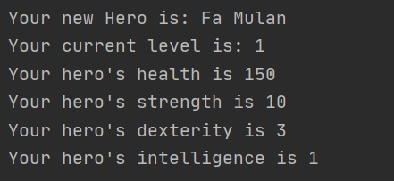
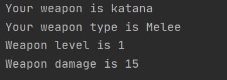
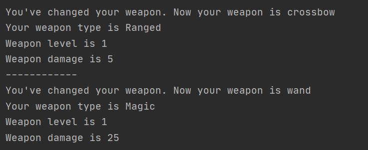
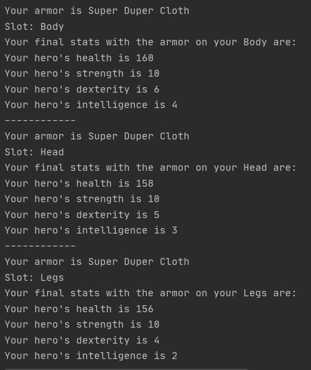
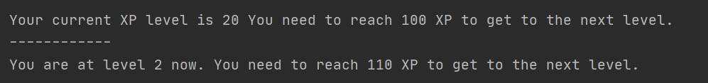
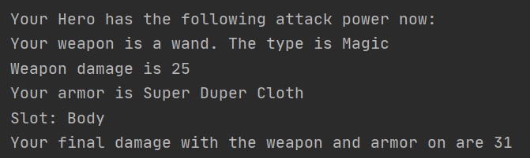

# This is an RPG character system showing the use of design patterns, SOLID principles and inheritance in Java.

## The general description of the project:

* Characters: warrior, ranger, mage

* Attributes: health, strength, dexterity and intelligence

* Weapon of types: Melee, Ranged, Magic

* Armor put on body, head or legs of types cloth, leather or plate

## Logic implemented in the project:

* Generating the character and demonstration of how their attributes change accordingly

* Creating a weapon

* Equipping the character with different types of weapon

* Changing the body slot of the armor and showing the change of attributes accordingly

* Showing the level of XP to get to the next level which grows by 10% on each level

* Showing the attack damage that is counted as a sum of the weapon damage that is increased according to the character's attribute

